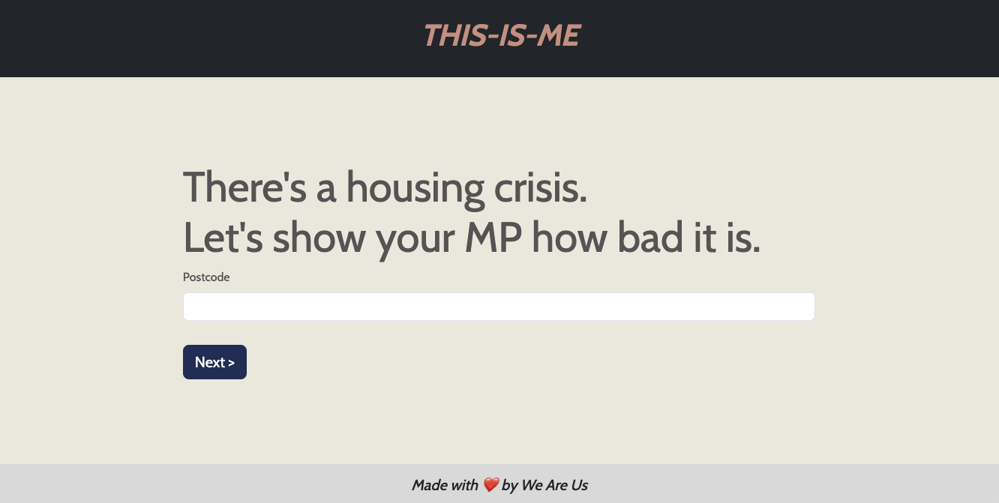

# This-Is-Me
[](https://opensource.org/licenses/MIT)

## Description
A data-driven participatory tool was created by We Are Us.
This-Is-Me is a tool that helps people see and use data on local house prices compared to average local salaries. Users can also compare current data with past data. A form collects users' lived experiences. You can get the housing data, make it personal to you, and send it over to your MP in one convincing argument. The app uses it to inform MPs about how their constituents feel. The features include two different API calls coordinated to return the stats and details we needed,  rapid development with React Hook Form., and animated data visualisation. A unique dataset was stored and retrieved from Sanity.io using GraphQL. Google Pagespeed scores have been marked as good.


You can view a live demo over at https://we-are-many-this-is-me.netlify.app/


## Table of contents
- [Installation](#installation)
- [Usage](#usage)
- [Creaters](#creators)
- [Acknowledgements](#acknowledgements)
- [License](#license)
- [Contributing](#contributing)

## Installation
To get the frontend running locally:
Required [Node](https://nodejs.org/en/download/)

- Clone this repo:
- `npm install` to install all required dependencies
- `npm run dev` to start the local server (this project uses [VITE v5.1.3](https://vitejs.dev/))

```console
git clone https://github.com/philManWithBeard/this-is-me
  ```
Open your browser and navigate to http://localhost:5173 to view the project.

## Usage
A tool for citizens to visualise and act on the data on local house costs against average salaries in the area. The charts will display the rising disparity between the two metrics - this then, with a personalised contact form, will let parliamentary member be aware of the exact sentiment and data of their constituents on the topic of housing affordability. 

## Creators
We Are Us:
- [Hamdi Sheikhabdullahi](https://github.com/hamdishh)
- [Philip Burrows](https://github.com/philManWithBeard)
- [Samual Cowell](https://github.com/CestSamual)
- [Setsu Adachi](https://github.com/Setsu-Adachi)

## Acknowledgements
- [React](https://react.dev/)
- [Bootstrap](https://getbootstrap.com/)
- [D3](https://d3js.org/)
- [Sanity CMS](https://www.sanity.io/developer-experience)
- [GraphQL](https://graphql.org/)
- [Herotofu](https://herotofu.com/)
- [Fontsource](https://fontsource.org/)
- [MembersAPI](https://members-api.parliament.uk/index.html)
- [FindthatPostcode](https://findthatpostcode.uk/)
- [Netlify](https://www.netlify.com/)
- [Vite](https://vitejs.dev/)
- [PageSpeed Insights](https://pagespeed.web.dev/)
- [We Are Many](https://github.com/CestSamual/We-Are-Many)

## License
Released under the [MIT License](https://github.com/jsxgraph/jsxgraph/blob/master/LICENSE.MIT)

## Contributing
If you have any suggestions or improvements, feel free to open an [issue](https://github.com/philManWithBeard/this-is-me/issues) or create a [pull request](https://github.com/philManWithBeard/this-is-me/pulls). Contributions are welcome!
If you have any questions or need help, don't hesitate to reach out. Happy coding!


